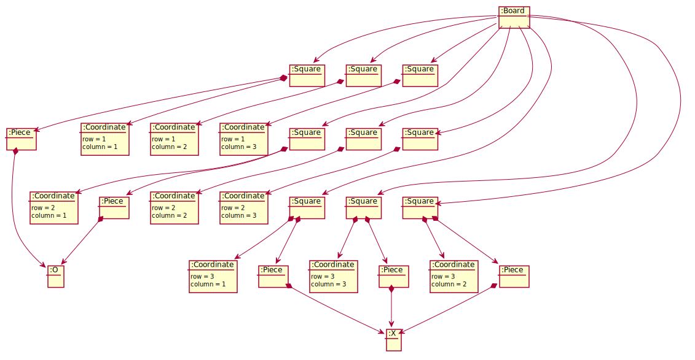

<!DOCTYPE html>
<html lang="en">
<head>
<meta charset="UTF-8">
<meta http-equiv="X-UA-Compatible" content="IE=edge">
<meta name="viewport" content="width=device-width, initial-scale=1.0">
<meta name="generator" content="Asciidoctor 2.0.8">
<meta name="author" content="Santa Tecla">
</head>
<body class="book">

<h1>TicTacToe. <strong>Guión</strong></h1>

Santa Tecla 
<a href="mailto:parqueNaturalSantaTecla@gmail.com">usantatecla@gmail.com</a> 
version 0.0.1

<h2 id="arquitectura">Modelo del dominio</h2>

<h3 id="arquitectura">Vocabulario</h3>

<h3 id="arquitectura">Estado Inicial</h3>

<h3 id="arquitectura">Estado Final. Objetivo TicTacToe en 3ª fila</h3>

<table class="tableblock frame-all grid-all stretch">
<colgroup>
<col style="width: 20%;">
<col style="width: 20%;">
<col style="width: 60%;">
</colgroup>
<thead>
<tr>
<th class="tableblock halign-left valign-top">Tema</th>
<th class="tableblock halign-left valign-top">Requisitos</th>
<th class="tableblock halign-left valign-top">Incremento</th>
</tr>
</thead>
<tbody>
<tr>
<td class="tableblock halign-left valign-top">

<strong>Modelo del Dominio</strong>

</td>
<td class="tableblock halign-left valign-top">

TicTacToe. Requisitos. Versión 1. <strong>Básica</strong>

</td>
<td class="tableblock halign-left valign-top" >

Versión básica, con interfaz de texto desde la consola, distribución Standalone y sin persistencia de los datos de la aplicación

</td>
</tr>
<td class="tableblock halign-left valign-top">

<strong>Diseño Modular y Orientado a Objetos</strong>

</td>
<td class="tableblock halign-left valign-top">

TicTacToe. Requisitos. Versión 2. <strong>Gráficos</strong>

</td>
<td class="tableblock halign-left valign-top">

Se añade la interfaz gráfica. Con este requisito funcional se consigue que el usuario pueda tener una interfaz más agradable que una consola de texto

</td>
</tr>
<tr>
<td class="tableblock halign-left valign-top" rowspan="6">

<strong>Patrones de Diseño</strong>

</td>
<td class="tableblock halign-left valign-top">

TicTacToe. Requisitos. Versión 3. <strong>UndoRedo</strong>

</td>
<td class="tableblock halign-left valign-top">

Se implementa la nueva funcionalidad de undo/redo, que permite deshacer y rehacer los estados del programa

</td>
</tr>
<tr>
<tr>
<td class="tableblock halign-left valign-top">

TicTacToe. Requisitos. Versión 4. <strong>ClienteServidor</strong>

</td>
<td class="tableblock halign-left valign-top">

Distribución de la aplicación en dos partes separadas y comunicadas. La parte de Cliente para la interfaz propia que usa el usuario y el Servidor dedicado al manejo y gestión de los datos

</td>
</tr>
<tr>
<td class="tableblock halign-left valign-top">

TicTacToe. Requisitos. Versión 5. <strong>Ficheros</strong>

</td>
<td class="tableblock halign-left valign-top">

Poder guardar el estado del programa. Se usan ficheros para el almacenamiento de estos datos y su recuperación

</td>
</tr>
<tr>
<td class="tableblock halign-left valign-top">

TicTacToe. Requisitos. Versión 6. <strong>BasesDatos</strong>

</td>
<td class="tableblock halign-left valign-top">

Se agrega la posibilidad de guardado en base de datos del estado del programa

</td>
</tr>
</tbody>
</table>

Version 0.0.1 
Last updated 2020-07-27 23:15:00 +0200

</html>