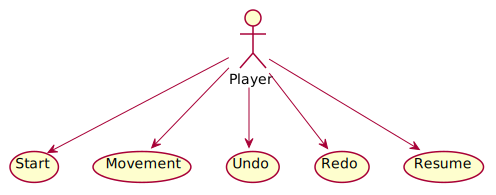
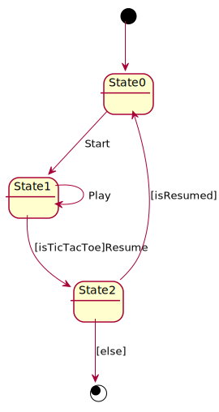

<!DOCTYPE html>
<html lang="en">
<head>
<meta charset="UTF-8">
<meta http-equiv="X-UA-Compatible" content="IE=edge">
<meta name="viewport" content="width=device-width, initial-scale=1.0">
<meta name="generator" content="Asciidoctor 2.0.8">
<meta name="author" content="Santa Tecla">
<link rel="stylesheet" href="https://fonts.googleapis.com/css?family=Open+Sans:300,300italic,400,400italic,600,600italic%7CNoto+Serif:400,400italic,700,700italic%7CDroid+Sans+Mono:400,700">

<link rel="stylesheet" href="https://cdnjs.cloudflare.com/ajax/libs/font-awesome/4.7.0/css/font-awesome.min.css">
</head>
<body class="book">

<h1>TicTacToe. Requisitos 4. <strong>Cliente/Servidor</strong></h1>

Santa Tecla 
<a href="mailto:parqueNaturalSantaTecla@gmail.com">parqueNaturalSantaTecla@gmail.com</a> 
version 0.4.0

Índice

<ul class="sectlevel1">
<li><a href="#requisitos">Requisitos</a></li>
<li><a href="#vista-de-casos-de-uso">Vista de Casos de Uso</a>
<ul class="sectlevel2">
<li><a href="#prototipo-de-interfaz">Prototipo de Interfaz</a></li>
</ul>
</li>
</ul>

<h2 id="requisitos">Requisitos</h2>

<table class="tableblock frame-all grid-all stretch">
<colgroup>
<col style="width: 50%;">
<col style="width: 50%;">
</colgroup>
<tbody>
<tr>
<td class="tableblock halign-left valign-top">

<ul>
<li>

<a href="https://en.wikipedia.org/wiki/Tic-tac-toe"><strong>Wiki</strong></a>

<ul>
<li>

<em>Funcionalidad: <strong>Básica</strong> + <strong>undo/redo</strong></em>

</li>
<li>

<em>Interfaz: <strong class="line-through">Gráfica</strong> y <strong>Texto</strong></em>

</li>
<li>

<em>Distribución: <strong>Standalone</strong> + <strong>Client/Server</strong></em>

</li>
<li>

<em>Persistencia: <strong>No</strong></em>

</li>
</ul>

</li>
</ul>

</td>
<td class="tableblock halign-left valign-top">

</td>
</tr>
</tbody>
</table>

<h2 id="vista-de-casos-de-uso">Vista de Casos de Uso</h2>

<table class="tableblock frame-all grid-all stretch">
<colgroup>
<col style="width: 50%;">
<col style="width: 50%;">
</colgroup>
<thead>
<tr>
<th class="tableblock halign-left valign-top">Diagrama de Actores y Casos de Uso</th>
<th class="tableblock halign-left valign-top">Diagrama de Contexto</th>
</tr>
</thead>
<tbody>
<tr>
<td class="tableblock halign-left valign-top">

</td>
<td class="tableblock halign-left valign-top">

</td>
</tr>
</tbody>
</table>

<h4 id="consola">Consola</h4>
<table class="tableblock frame-all grid-all stretch">
<colgroup>
<col style="width: 50%;">
<col style="width: 50%;">
</colgroup>
<tbody>
<tr>
<td class="tableblock halign-left valign-top">

<pre>-------------------- TIC TAC TOE --------------------
Number of users [0-2] 1
----- Choose one option -----
1) Do a movement
1
-----------------------------------------------------
| - | - | - |
| - | - | - |
| - | - | - |
-----------------------------------------------------
Enter a coordinate to put a token:
Row: 1
Column: 1
-----------------------------------------------------
| X | - | - |
| - | - | - |
| - | - | - | 
-----------------------------------------------------
----- Choose one option -----
1) Do a movement
1
-----------------------------------------------------
| X | - | - |
| - | - | - |
| - | - | - |
-----------------------------------------------------
-----------------------------------------------------
| X | - | - |
| - | - | - | 
| - | - | O |
-----------------------------------------------------
----- Choose one option -----
1) Do a movement
2) Undo previous movement
1
-----------------------------------------------------
| X | - | - |
| - | - | - |
| - | - | O |
-----------------------------------------------------
Enter a coordinate to put a token:
Row: 1
Column: 2
-----------------------------------------------------
| X | X | - |
| - | - | - |
| - | - | O |
-----------------------------------------------------
----- Choose one option -----
1) Do a movement
2) Undo previous movement
2
-----------------------------------------------------
| X | - | - |
| - | - | - |
| - | - | O |
-----------------------------------------------------
----- Choose one option -----
1) Do a movement
2) Undo previous movement
3) Redo previous movement
3
-----------------------------------------------------
| X | X | - |
| - | - | - |
| - | - | O |
-----------------------------------------------------</pre>

</td>
<td class="tableblock halign-left valign-top">

<pre>----- Choose one option -----
1) Do a movement
2) Undo previous movement
1
-----------------------------------------------------
| X | X | - |
| - | - | - |
| - | - | O |
-----------------------------------------------------
-----------------------------------------------------
| X | X | O |
| - | - | - |
| - | - | O |
-----------------------------------------------------
----- Choose one option -----
1) Do a movement
2) Undo previous movement
2
-----------------------------------------------------
| X | X | - |
| - | - | - |
| - | - | O |
-----------------------------------------------------
----- Choose one option -----
1) Do a movement
2) Undo previous movement
3) Redo previous movement
1
-----------------------------------------------------
| X | X | - |
| - | - | - |
| - | - | O |
-----------------------------------------------------
-----------------------------------------------------
| X | X | - |
| O | - | - |
| - | - | O |
-----------------------------------------------------
----- Choose one option -----
1) Do a movement
2) Undo previous movement
1
-----------------------------------------------------
| X | X | - |
| O | - | - |
| - | - | O |
-----------------------------------------------------
Enter a coordinate to put a token:
Row: 1
Column: 3
-----------------------------------------------------
| X | X | X |
| O | - | - |
| - | - | O |
-----------------------------------------------------
X Player: You win!!! :-)
Do you want to continue? (y/n): y
-------------------- TIC TAC TOE --------------------
Number of users [0-2]</pre>

</td>
</tr>
</tbody>
</table>

Version 0.4.0 
Last updated 2020-08-27 22:00:00 +0200

</html>